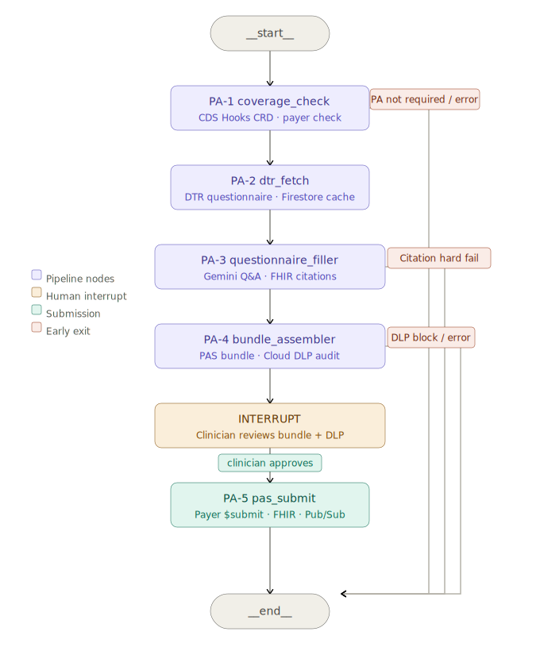

# I Rebuilt the Same Healthcare AI Agent in LangGraph — Here's What Changed

*Same Da Vinci CRD + DTR + PAS pipeline. Same GCP stack. Different orchestration architecture. A direct comparison between Google ADK and LangGraph for compliance-critical clinical workflows.*

**Gregory Horne** | Portfolio Project 2b of 9: Healthcare Agentic AI Series | [github.com/gbhorne/langgraph-prior-authorization-agent](https://github.com/gbhorne/langgraph-prior-authorization-agent)

---


*LangGraph StateGraph: 5 deterministic nodes, 3 conditional early-exit edges, and a native human-in-the-loop interrupt before payer submission.*

---

A few weeks ago I published [I Built an AI Agent That Files Prior Authorizations Autonomously](https://medium.com/@gbhorne), documenting a Google ADK agent that runs the full Da Vinci CRD + DTR + PAS pipeline end-to-end in 81 seconds. Gemini 2.5 Flash orchestrates five sequential tool calls — coverage check, questionnaire fetch, questionnaire fill, bundle assembly, and payer submission — returning an APPROVED decision with a ClaimResponse written to a live Google Cloud Healthcare FHIR R4 store.

That build demonstrated what LLM-driven orchestration looks like for a real clinical workflow. This article documents the rebuild of the exact same pipeline in LangGraph — and more importantly, what the comparison reveals about when to use each framework.

> *The LangGraph version runs the same five steps. The pipeline output is identical. The architecture is fundamentally different. This article is about why that matters for healthcare AI.*

---

## Why Rebuild It?

The ADK version is genuinely impressive. Gemini handles ambiguous questionnaire answers, routes around missing data, and surfaces DLP violations — all without a single explicit conditional branch in the orchestration code. You describe what you want, and the LLM figures out how to get there.

But prior authorization is a compliance-critical workflow. Every decision is auditable. Payers, regulators, and EHR vendors will ask: what ran, in what order, with what inputs, and who approved it before it was submitted? The ADK trace panel answers those questions beautifully for a demo. But what about a production system where a compliance officer needs a queryable audit trail per submission ID, per patient, per payer?

That question led me to LangGraph.

---

## The Framework Comparison

Before getting into the build, here is the core architectural difference in one table:

| Dimension | Google ADK | LangGraph |
|---|---|---|
| Orchestration | Gemini decides which tool to call next | Deterministic graph edges |
| State | Tool return values passed back into LLM context | TypedDict, persisted per node by checkpointer |
| Early exits | LLM exception handling | Conditional edge functions |
| Human review gate | ClaimResponse written as `status=draft` | `interrupt_before=["pas_submit"]` — graph literally pauses |
| Observability | ADK Web UI trace panel | LangSmith per-node waterfall + LangGraph Studio |
| Compliance audit | LLM trace logs | Typed state snapshots per thread_id, queryable |
| Best suited for | Ambiguous clinical Q&A, flexible routing | Deterministic compliance pipelines, auditable state |

Neither is better. The ADK version is the right choice when you want the LLM to handle ambiguity intelligently. The LangGraph version is the right choice when you need every routing decision to be explicit, auditable code.

---

## The Pipeline: Same Steps, Different Engine

The clinical workflow is identical to the ADK version:

1. **PA-1 — coverage_check**: Call the payer's CDS Hooks CRD endpoint. Does this CPT code require prior authorization under this patient's coverage?
2. **PA-2 — dtr_fetch**: Fetch the payer's Da Vinci DTR questionnaire, with Firestore caching per payer+CPT.
3. **PA-3 — questionnaire_filler**: Use Gemini 2.5 Flash to answer each questionnaire item, citing specific FHIR resource IDs from the patient bundle.
4. **PA-4 — bundle_assembler**: Assemble a Da Vinci PAS-compliant FHIR transaction bundle and run Cloud DLP audit on outbound PHI.
5. **PA-5 — pas_submit**: Submit to the payer's `$submit` endpoint, write ClaimResponse to FHIR, publish decision to Pub/Sub.

In the ADK version, Gemini decides to call these tools in sequence. In the LangGraph version, the graph does.

---

## The StateGraph

The graph is defined in `langgraph_prior_auth/graph.py`. Here is the full structure:

```python
builder = StateGraph(PAState)

builder.add_node("coverage_check", node_coverage_check)
builder.add_node("dtr_fetch", node_dtr_fetch)
builder.add_node("questionnaire_filler", node_questionnaire_filler)
builder.add_node("bundle_assembler", node_bundle_assembler)
builder.add_node("pas_submit", node_pas_submit)

builder.set_entry_point("coverage_check")

builder.add_conditional_edges("coverage_check", route_after_coverage,
    {"dtr_fetch": "dtr_fetch", "__end__": END})
builder.add_edge("dtr_fetch", "questionnaire_filler")
builder.add_conditional_edges("questionnaire_filler", route_after_questionnaire,
    {"bundle_assembler": "bundle_assembler", "__end__": END})
builder.add_conditional_edges("bundle_assembler", route_after_bundle,
    {"pas_submit": "pas_submit", "__end__": END})
builder.add_edge("pas_submit", END)

graph = builder.compile(
    checkpointer=checkpointer,
    interrupt_before=["pas_submit"],
)
```

Every routing decision is a named Python function. Every early exit is an explicit edge. The graph structure is the documentation.

---

## Typed State: The Key Difference

In the ADK version, state flows through Gemini's context window. The LLM reads tool outputs and decides what to pass to the next tool. This is powerful and flexible — but it is also opaque.

In the LangGraph version, state is a `TypedDict` with a field for every piece of information that flows through the pipeline:

```python
class PAState(TypedDict):
    # Inputs
    patient_id: str
    cpt_code: str
    payer_id: str
    encounter_id: Optional[str]
    practitioner_id: Optional[str]

    # PA-1 outputs
    pa_required: Optional[bool]
    coverage_status: Optional[str]
    coverage_fhir_id: Optional[str]
    coverage_check_error: Optional[str]

    # PA-2 outputs
    questionnaire: Optional[dict]
    questionnaire_id: Optional[str]

    # PA-3 outputs
    answers: Optional[list]
    missing_required_count: Optional[int]

    # PA-4 outputs
    pas_bundle: Optional[dict]
    dlp_blocked: Optional[bool]
    dlp_findings: Optional[list]

    # PA-5 outputs
    claim_response_id: Optional[str]

    # Final
    decision: Optional[Literal["APPROVED", "DENIED", "NOT_REQUIRED", "PENDING", "ERROR"]]
    decision_reason: Optional[str]
```

Every field has a type. Every node returns a dict that updates a subset of fields. The checkpointer serializes the full state after each node — meaning you can inspect exactly what the graph knew at any point in any run, by thread ID.

---

## Conditional Edges: Explicit Early Exits

The ADK version handles early exits through LLM exception handling — if PA is not required, Gemini surfaces that and stops. Clean, but implicit.

The LangGraph version makes every exit condition an explicit routing function:

```python
def route_after_coverage(state: PAState) -> str:
    if state.get("coverage_check_error") or state.get("pa_required") is False:
        return "__end__"
    return "dtr_fetch"

def route_after_questionnaire(state: PAState) -> str:
    if state.get("filler_error") or (state.get("missing_required_count") or 0) > 0:
        return "__end__"
    return "bundle_assembler"

def route_after_bundle(state: PAState) -> str:
    if state.get("assembler_error") or state.get("dlp_blocked"):
        return "__end__"
    return "pas_submit"
```

These are testable. You can unit test each routing function in isolation with mock state. You can read the graph and know exactly what will happen under every condition without running it.

---

## Human-in-the-Loop: The Architectural Upgrade

This is the most significant difference between the two builds, and the most important one for clinical workflows.

In the ADK version, the human review gate is implemented by writing the ClaimResponse with `status=draft`. The idea is that a downstream clinical workflow promotes it to `active` before triggering any care action. Correct, but the gate lives outside the agent.

In the LangGraph version, the gate lives inside the graph:

```python
graph = builder.compile(
    checkpointer=checkpointer,
    interrupt_before=["pas_submit"],
)
```

After PA-4 completes, the graph literally stops. No LLM is running. No GCP resources are being consumed. The graph is frozen at a specific checkpoint with a specific thread ID. A clinician can retrieve the full state:

```python
snapshot = graph.get_state(config)
bundle = snapshot.values["pas_bundle"]
dlp_findings = snapshot.values["dlp_findings"]
answers = snapshot.values["answers"]
```

Review the assembled bundle. Check the DLP findings. Inspect which FHIR resources Gemini cited for each questionnaire answer. Then resume:

```python
graph.invoke(None, config=config)
```

Or discard the thread entirely. Every state snapshot is persisted by the checkpointer with a timestamp. The full audit trail — inputs, node outputs, routing decisions, the interrupt, the resume — is queryable per thread ID without touching any log files.

This is not just a nicer demo. For a production PA system, this is the architecture a compliance officer would require.

---

## LangSmith Observability

The ADK version has the ADK Web UI trace panel. The LangGraph version has LangSmith.

After running the pipeline, every execution appears in LangSmith with per-node latency, state diffs, token counts, and the full input/output at each step:

| Node | Typical latency |
|---|---|
| coverage_check | 1.8s |
| dtr_fetch | 0.1s (cache hit) / 1.6s (miss) |
| questionnaire_filler | 6–20s (Gemini) |
| bundle_assembler | 1.5s |
| pas_submit | 0.8s |

The questionnaire_filler latency range reflects Gemini's reasoning time for different questionnaire complexity. The 6-item CGM questionnaire for CPT 95251 consistently completes in 6–8 seconds.

Zero token cost shown for most nodes is correct — the pipeline's GCP calls (FHIR, Firestore, DLP, Pub/Sub) don't route through LangSmith's token tracking. Only the Gemini call in PA-3 would show token usage if using a LangChain-wrapped model client.

---

## LangGraph Studio: The Visual Debugger

LangGraph Studio is the `adk web` equivalent for LangGraph. Start the dev server:

```powershell
langgraph dev --allow-blocking
```

Open the Studio URL in your browser. You get a visual node graph, a form to enter the initial state, and a live execution panel that shows each node completing with its state output as it runs.

The interrupt fires after PA-4. Studio shows a Continue button next to the `pas_submit` node. Click it to resume. The full node waterfall with timing, state, and routing decisions is captured in the Trace tab.

---

## What Stayed the Same

Everything below the LangGraph orchestration layer is identical to the ADK version:

- The five tool functions in `agents/prior_auth/tools/` — zero changes
- The GCP stack: Cloud Healthcare FHIR R4, Firestore, Cloud DLP, Pub/Sub, Secret Manager
- The Da Vinci CRD/DTR/PAS protocol implementation
- Gemini 2.5 Flash for questionnaire filling in PA-3
- The synthetic patient dataset: James Thornton, CPT 95251, BCBS California
- The mock payer server for local development

The LangGraph layer adds orchestration, state management, checkpointing, and the human-in-the-loop interrupt. It does not change what the clinical pipeline does.

---

## The Technical Lesson

Building both versions of the same pipeline clarified something that gets lost in framework debates: orchestration and logic are separate concerns.

The ADK version conflates them. Gemini does both — it reasons about the clinical context AND decides what to run next. This is efficient and often the right choice. But it means you cannot unit test the routing, cannot guarantee the execution order, and cannot audit the decision path without reading LLM trace logs.

The LangGraph version separates them. The graph handles orchestration — explicitly, deterministically, testably. Gemini handles clinical reasoning — the questionnaire filling, the FHIR citation, the confidence scoring. Each does what it is best at.

For a healthcare compliance workflow, that separation is not just architectural preference. It is what an audit requires.

---

## What I Would Do Differently

**Async nodes natively.** The current implementation wraps async tool functions in `ThreadPoolExecutor` to bridge the sync/async boundary between LangGraph's node execution and the aiohttp-based FHIR client. This works but produces blocking warnings in LangGraph Studio. The right fix is to refactor the nodes as native async functions — which LangGraph supports — rather than wrapping sync calls around async code.

**Postgres checkpointer from the start.** The MemorySaver checkpointer is fine for development but resets on every process restart. For a production system, swap it for `PostgresSaver` backed by Cloud SQL or AlloyDB on GCP. The state schema and all node logic stay identical — it is a one-line change in `build_graph()`.

**Registered types in the checkpointer.** LangGraph's checkpoint serializer warns about unregistered custom types (`QuestionnaireAnswer`, `AnswerConfidence`) when it encounters them in state. The fix is to register them with `allowed_msgpack_modules` at graph compile time. Minor but worth doing before publishing a production build.

---

## Run It Yourself

```bash
git clone https://github.com/gbhorne/langgraph-prior-authorization-agent
cd langgraph-prior-authorization-agent
python -m venv .venv
.venv\Scripts\Activate.ps1
pip install -r requirements.txt
```

Configure `.env` with your GCP project and a LangSmith API key (free Developer tier, 5,000 traces/month).

```powershell
# Terminal 1 — mock payer server
python scripts/mock_payer_server.py

# Terminal 2 — run the graph
python -m langgraph_prior_auth.run
```

Phase 1 runs PA-1 through PA-4 and pauses at the interrupt. Review the bundle summary and DLP findings in the terminal. Type `y` to approve and fire PA-5.

Or run with LangGraph Studio:

```powershell
langgraph dev --allow-blocking
```

---

## The Portfolio Story

Both repos are public and cross-referenced:

- **[ADK version](https://github.com/gbhorne/adk-prior-authorization-agent)** — LLM-orchestrated, Gemini-driven, 81 seconds end-to-end, APPROVED decision
- **[LangGraph version](https://github.com/gbhorne/langgraph-prior-authorization-agent)** — deterministic StateGraph, typed state, native human-in-the-loop interrupt, LangSmith traces

Together they demonstrate something more valuable than either build alone: the judgment to match orchestration architecture to requirements. The ADK version is the right choice for flexible, ambiguity-tolerant clinical workflows. The LangGraph version is the right choice for compliance-auditable pipelines where every routing decision needs to be explicit, testable, and queryable.

Prior authorization is both. That is why building it twice was worth it.

---

## Resources

- GitHub: [github.com/gbhorne/langgraph-prior-authorization-agent](https://github.com/gbhorne/langgraph-prior-authorization-agent)
- ADK companion build: [github.com/gbhorne/adk-prior-authorization-agent](https://github.com/gbhorne/adk-prior-authorization-agent)
- ADK Medium article: [I Built an AI Agent That Files Prior Authorizations Autonomously](https://medium.com/@gbhorne)
- LangGraph docs: [langchain-ai.github.io/langgraph](https://langchain-ai.github.io/langgraph)
- LangSmith: [smith.langchain.com](https://smith.langchain.com)
- Da Vinci PAS IG: [build.fhir.org/ig/HL7/davinci-pas/](https://build.fhir.org/ig/HL7/davinci-pas/)
- Google Cloud Healthcare API: [cloud.google.com/healthcare-api](https://cloud.google.com/healthcare-api)

---

*Gregory Horne | gregory.horne@gbhorne.com | github.com/gbhorne*
